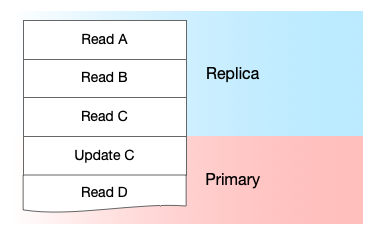

# Scaling a PostgreSQL Database

This project demonstrates how a Django web app can cache PostgreSQL LSNs in Redis to effectively utilize PostgreSQL read-replicas while avoiding returning stale data (previously written in another web/API request from the same user). This is a simplified example of a project completed during my time working on Bitbucket Cloud for Atlassian, covered in this [blog post Scaling Bitbucket's Database](https://bitbucket.org/blog/scaling-bitbuckets-database).

## WAL and LSN

[Write-Ahead Logging (WAL)](https://www.postgresql.org/docs/current/wal-intro.html)

> WAL's central concept is that changes to data files (where tables and indexes reside) must be written only after those changes have been logged, that is, after log records describing the changes have been flushed to permanent storage. 

[Log Sequence Number (LSN)](https://www.postgresql.org/docs/current/wal-internals.html)

> WAL records are appended to the WAL logs as each new record is written. The insert position is described by a Log Sequence Number (LSN) that is a byte offset into the logs, increasing monotonically with each new record. Values can be compared to calculate the volume of WAL data that separates them, so they are used to measure the progress of replication and recovery.

## Set up PostgreSQL

The `docker-compose.yml` file defines two PostgreSQL containers named `db` and `replica`. PostgreSQL has [Log-Shipping Standby Servers](https://www.postgresql.org/docs/13/warm-standby.html) capability which basically means the replica can receive a stream of updates to the primary database over a TCP connection.

### Set up db (primary, read/write)

Bring up the `db` container and initialize the database. Kill it.

    % docker-compose up db
    CTRL-C

Move the `./pg_hba.conf` file into place with permission for other hosts to replicate the database. Bring `db` back up. This is not secure.

    host    replication     all             0.0.0.0/0               trust

    % cp -v pg_hba.conf data/db
    % docker-compose up -d db

Create a replication slot by running the following query on the primary database. It ensures that the WAL isn't cleaned-up until the replica using that slot is caught up.

    % docker-compose exec db bash
    # psql -U postgres
    # select * from pg_create_physical_replication_slot('replica');

### Set up replica (read-only)

The `./replica.conf` file in this repository is dropped into place as the PostgreSQL configuration file. It importantly includes the following settings:

    primary_conninfo = 'host=db user=postgres password=postgres'
    primary_slot_name = 'replica' 
    hot_standby = on 

Shutdown the master and copy over the data directory. A server enters standby mode if a `standby.signal` file exists in the data directory when the server is started. Start up the replica

    % cp -vr data/db data/replica
    % touch data/replica/standby.signal
    % docker-compose up -d replica; docker-compose logs -f replica

    database system is ready to accept read only connections
    started streaming WAL from primary at 0/1000000 on timeline 1

Then watch on the primary db...

    # select slot_name, slot_type, active, active_pid, restart_lsn, wal_status from pg_replication_slots;

    slot_name   | replica
    slot_type   | physical
    active      | t
    active_pid  | 35
    restart_lsn | 0/15CE420
    wal_status  | reserved

You can create tables on the primary and see them on the replica.

    docker-compose exec web ./manage.py migrate
    docker-compose exec web ./manage.py createsuperuser
    docker-compose exec replica psql -U postgres -c 'select * from auth_user;'

## Multiple db operations in a single request

The intention is for all views (API endpoints) in the web app to automatically use the replica until a write operation is performed. From that point on the primary database is used.

This is achieved with a Django database router in `app/router.py`. It takes advantage of the fact that Django uses a new thread for each request and stores the state of `write_happened` in a thread-local variable. This is to overcome the fact that database routers are instantiated only once at startup, so the __init__ method can't be used to store the state in a member variable.

The logging in the router shows that it in fact works as expected.

    % http POST localhost:8000/things color=orange

    % http POST localhost:8000/things/1 color=blue
    HTTP/1.1 200 OK
    [
        {
            "fields": {
                "color": "blue"
            },
            "model": "app.thing",
            "pk": 1
        }
    ]

    db_for_read replica, 'Thread-6'
    db_for_read replica, 'Thread-6'
    db_for_read replica, 'Thread-6'
    db_for_read default, 'Thread-6'

Note that the view for updating a thing in `app/views.py` has some senseless read operations in it just to demonstrate this point.

    thing = Thing.objects.get(pk=pk)

    if request.method == 'POST':
        # This is senseless, but simulates three read operations to the replica
        thing = Thing.objects.get(pk=pk)
        thing = Thing.objects.get(pk=pk)

        data = json.loads(request.body.decode('utf-8'))
        thing.color = data['color']
        thing.save()

        # This is senseless, but simulates a read operation to the primary
        thing = Thing.objects.get(pk=pk)
